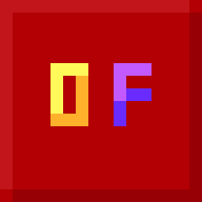

OptiFuture

====

This is a mod that forked from the MCPatcher for Forge. Aiming to backport new features from OptiFine / Continuity.
Implimenting it only via [doc from Optifine](https://github.com/sp614x/optifine/tree/master/OptiFineDoc/doc) and [source frome Continuity](https://github.com/PepperCode1/Continuity).

----

# 🌿Featrues (Via OptiFine doc, Impilmented will have a mark)

- [x] [backgound.properties](https://github.com/sp614x/optifine/blob/master/OptiFineDoc/doc/background.properties)
- [ ] CEM (Custom Entity Model) series: [cem_part.txt](https://github.com/sp614x/optifine/blob/master/OptiFineDoc/doc/cem_part.txt), [cem_model](https://github.com/sp614x/optifine/blob/master/OptiFineDoc/doc/cem_model.txt), [cem_animation.txt](https://github.com/sp614x/optifine/blob/master/OptiFineDoc/doc/cem_animation.txt). (CEM Loader was created while none of one Mixin implimentation is finished)
- [x] ctm_compact, overlay series from modern [ctm.properties](https://github.com/sp614x/optifine/blob/master/OptiFineDoc/doc/ctm.properties#L73C1-L84C10)
- [ ] [Continuity-Connected-Textures-Specification](https://github.com/PepperCode1/Continuity/wiki/Continuity-Connected-Textures-Specification)
- [x] [custom_guis.properties](https://github.com/sp614x/optifine/blob/master/OptiFineDoc/doc/custom_guis.properties)
- [x] [loading.properties](https://github.com/sp614x/optifine/blob/master/OptiFineDoc/doc/loading.properties)
- [ ] [custom_animations.txt](https://github.com/sp614x/optifine/blob/master/OptiFineDoc/doc/custom_animations.txt)
- [x] modern features from [random_entities.properties](https://github.com/sp614x/optifine/blob/master/OptiFineDoc/doc/random_entities.properties)
- [ ] [better_grass.properties](https://github.com/sp614x/optifine/blob/master/OptiFineDoc/doc/bettergrass.properties)
- [ ] [natural.properties](https://github.com/sp614x/optifine/blob/master/OptiFineDoc/doc/natural.properties)

----

# 📄License

- Original code by prupe is licensed under [MIT](LICENSE-Original).
- MCpatcher For Forge code made by [mist345](https://github.com/mist475) is under [LGPLv3](LICENSE-MCPatcherForge).
- The textures is under [CC-BY-SA-4.0](LICENSE-Assets) by darkbum.
- And Now It Back to the [MIT](LICENSE-ModernFeature).

# 🙌Credits

- Purpe, for original code, and the creation.
- mist345, for MCPatcherForge.
- DarkBum, for creating examole CTM assets.
- PepperCode1, for Continuity source code.
- sp614x, for the optifine + modern feature standard docs.

----

# ❌Known incompatibilities:
- FastCraft, causes weird chunk flickering on loading (no fix planned,hence it's a closed source mod)
- Future commands, something happens between its asm and my mixins. No fix planned as I can't find the source code.
- Optifine: Implements the same features, resulting in a crash on startup (no fix planned)
- FalseTweaks: Will need looking into
